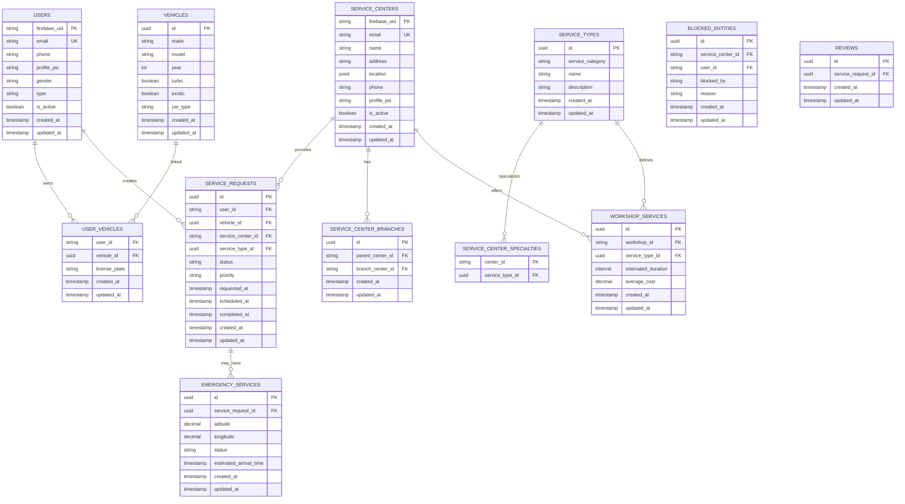

# El7a2ny-Backend

## Database Schema

The following ERD (Entity Relationship Diagram) represents the structure of the database:

# Start of Backend Documentation

Naming convention for branches and commits:
Branches: start with feat or fix for example
feat/EL7-1-creation-of-navbar
commits:
feat or fix too
feat(navbar): main navbar for dashboard
